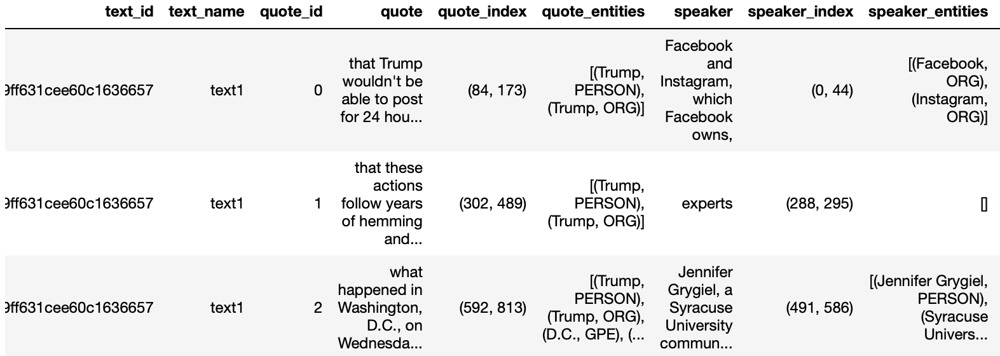

# HASS-29: Quotation Tool

## Sydney Informatics Hub

<b>Abstract:</b> This QuotationTool can be used to extract quotes in a text. In addition to extracting the quotes, the tool also provides information about who the speakers are, the location of the quotes (and the speakers) within the text, the identified named entities, etc., which can be useful for your text analysis.

## Setup
This tool has been designed for use with minimal setup from users. You are able to run it in the cloud and any dependencies with other packages will be installed for you automatically. You just need to click the below icon to launch and use the tool.

## Load the data
<table style='margin-left: 10px'><tr>
<td>  </td>
<td>  </td>
<td>  </td>
</tr></table>

Using this tool, you can extract quotes directly from a text file (or a number of text files). Alternatively, you can also extract quotes from a text column inside your excel spreadsheet. You just need to upload your files (.txt, .xlsx or .csv) and access them via the Notebook.

## Extract and Display the Quotes
Once your files have been uploaded, you can use the QuotationTool to extract quotes from the text. The quotes, along with their metadata, will be stored in a table format in a pandas dataframe. 

 

Subsequently, using the interactive tool, you can display your text, the extracted quotes, speakers and named entities for further analysis.

## Reference
This code has been adapted (with permission) from the [GenderGapTracker GitHub page](https://github.com/sfu-discourse-lab/GenderGapTracker/tree/master/NLP/main) and modified to run on a Jupyter Notebook. The quotation tool’s accuracy rate is evaluated in [this article](https://journals.plos.org/plosone/article?id=10.1371/journal.pone.0245533).
